## Burn-Down Chart & Task Board

|Date|Burn-Down Chart|Task Board|
|----|---------------|----------|
|0622|  |     |
|0624|  |     |
|0626|  |     |
|0628|  |     |
|0629| 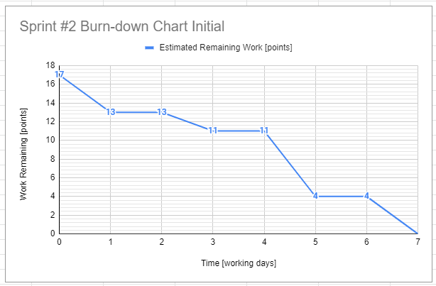 |  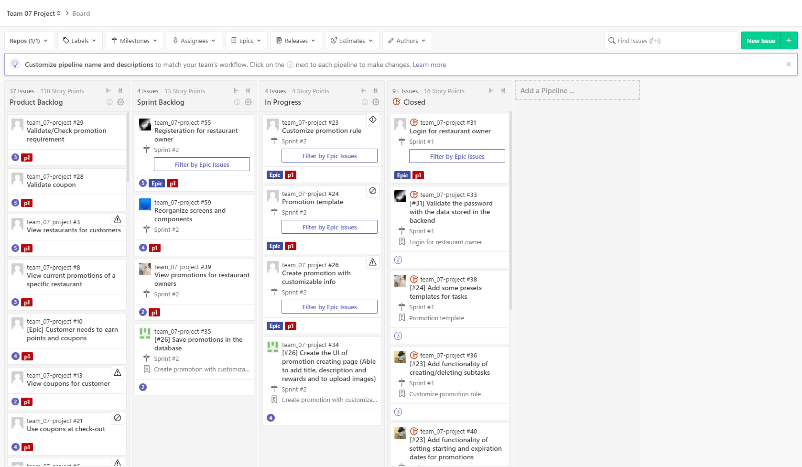   |
|0705| 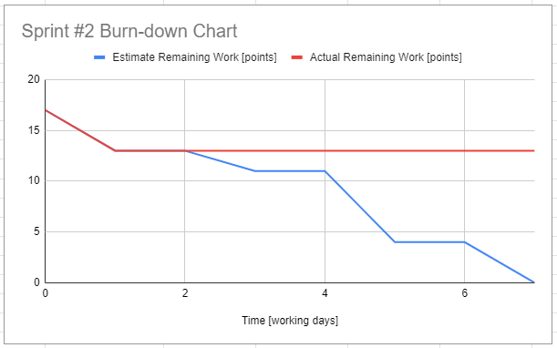 |  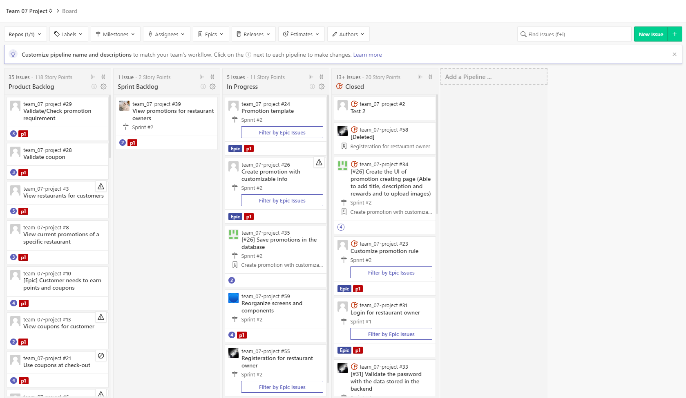   |
|0706| 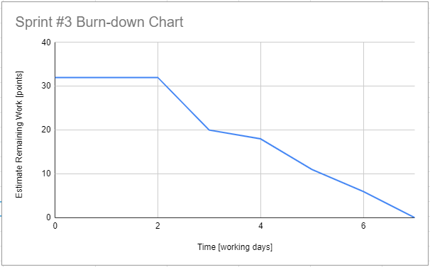 |  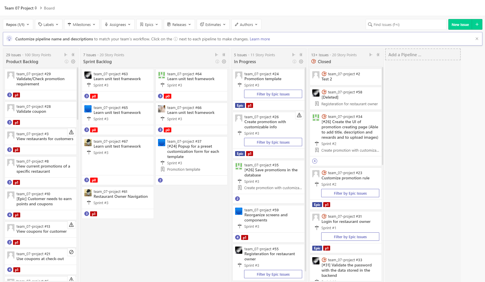   |
|0712| 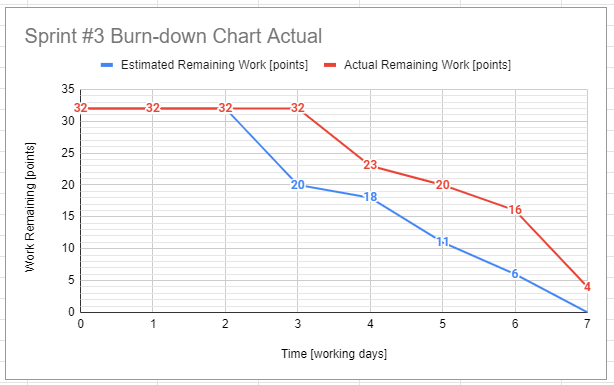 |     |
|0713| 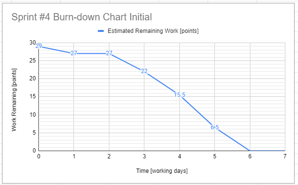 |  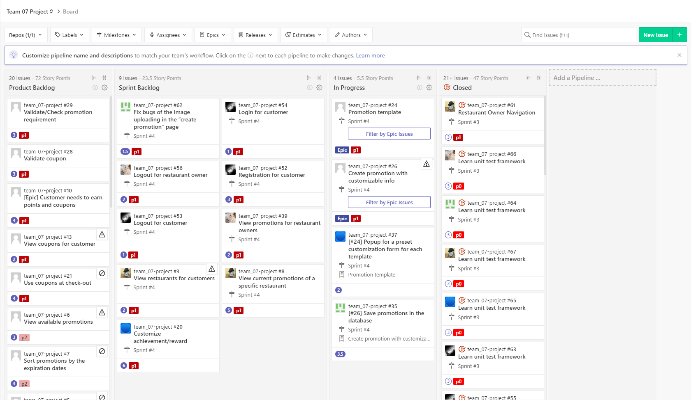   |
|0719| 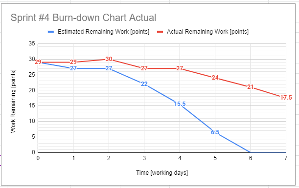 |  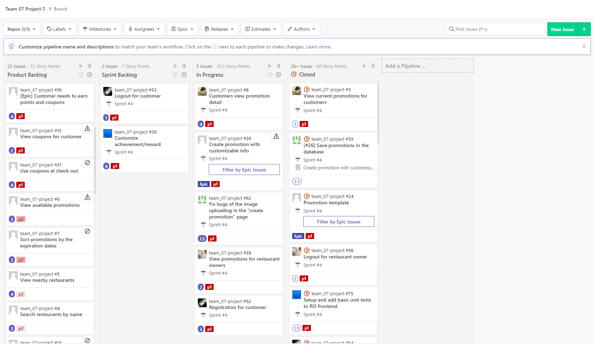   |
|0720| 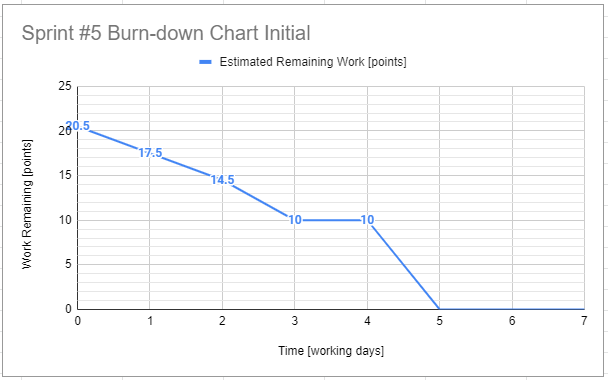 |  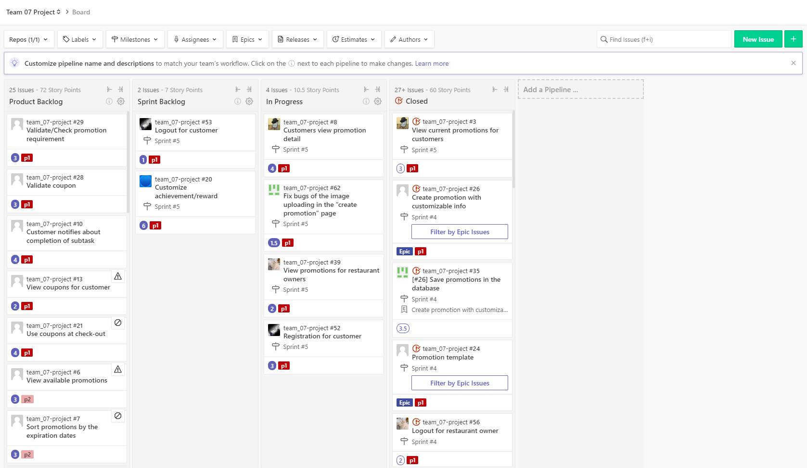   |
|0722| 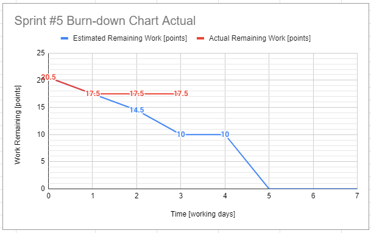 |     |
|0724| 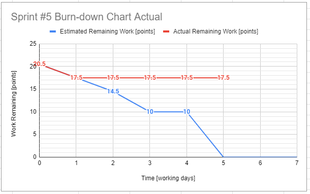 |  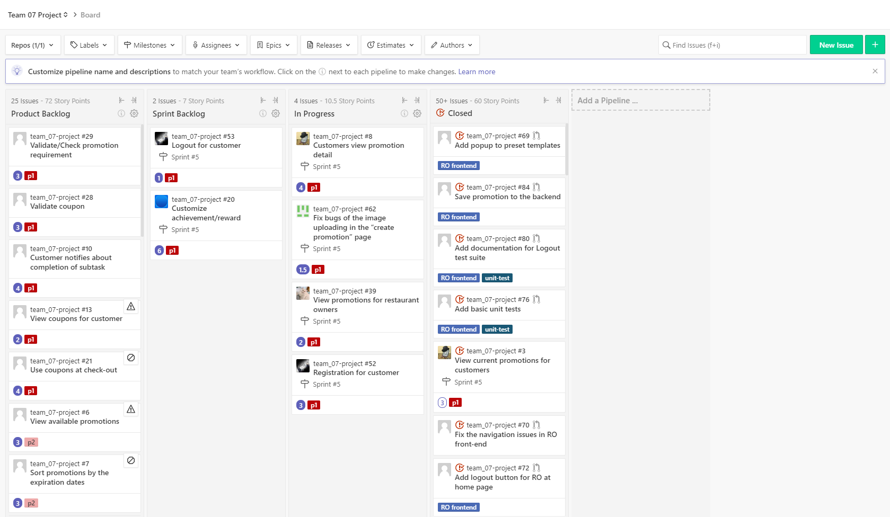   |
|0726| 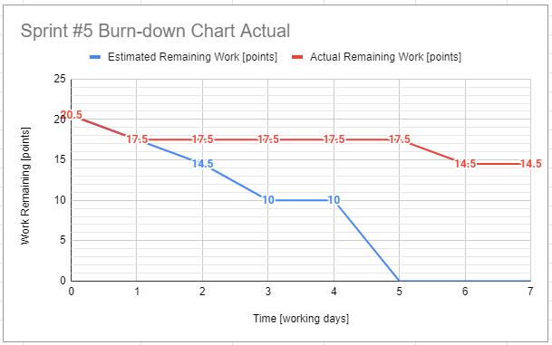 |  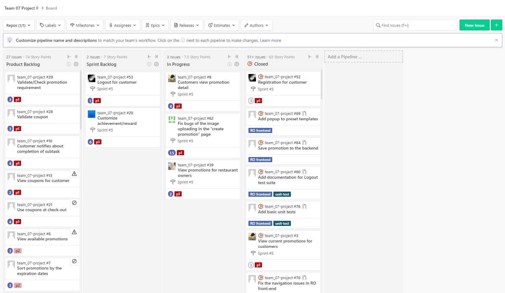   |