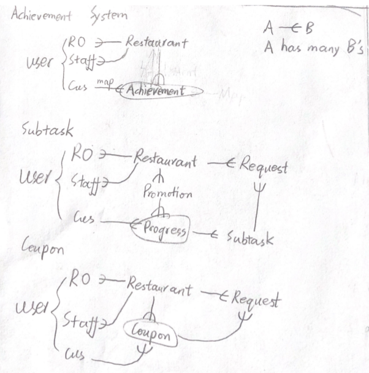

### 1. Endpoints

**Notice:** We **do not** provide DELETE method.

#### customer:

##### GET

* `/promotion` filtered by expired_time: front-end

* `/users/me` progresses, achievements and coupons

##### POST

* `/processes`

* `/requests`
* `/achievements`
* `/coupons`
* `/subtasks`

##### PUT

* `/achievement` change complete_number


#### RO:

##### GET

* `/promotions` filtered by restaurant: back-end

##### POST

* `/promotions`


#### Staff:

##### GET

* `/requests` filtered by restaurant (and status) (at your own discretion): front- or back-end

##### PUT

* `/requests` status
* `/subtasks` status
* `/coupons` status


### 2. Pitfalls

1. Progresses are called by `/processes`, **not** `/progresses`.
2. It is expected that expired data are still sent to the the front-end. Expired data should not be deleted. The front-end is responsible for filtering the data.
3. Customer promotion list is rendered by both database promotions and progresses.
4. Achievements can only be created **if and only if** a progress from a new restaurant is completed.
5. Subtasks are created only when their progress is initialized. Coupons are created only when we need a coupon request.
6. RO does not create coupon objects or progress. RO only deals with promotions.


### 3. Important Logic

##### customers participate a new promotion

trigger: click "participate" in promotion detail page

1. create a new progress for user based on the promotion
2. create all the subtasks for the progress


##### customers request a subtask validation

trigger: click "validate" in the subtask area

1. create request
2. (staff confirm) change request status and subtask status
3. check all subtask status


##### customers completed a progress

trigger: all subtasks are completed

1. change progress status to completed

2. check customer achievements and:

   ```
   if has progress->restaurant:
   	achievement->completed_number ++
   else:
   	create new achievement
   ```
3. create acoupon


##### customers use a coupon

trigger: click "use it" in the coupon area

1. create a request

2. (staff confirm) change request status and coupon status

   (this is expected: customer can request repeatedly if the status is pending)
